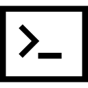

**Hello, World!**

My name is Cynthia (oftentimes referred to as cynth). I'm a Full-Stack (JavaScript) Developer, and a unicorn.

- 👀 I am currently working on some challenges on Frontend Mentor to improve my front-end development.
- 👀 I’m interested in systems design, architecture and cloud computing.
- 👀 I’m currently learning web and mobile application design and development using the JAM stack and a bunch of other technologies.
- 👀 I’m looking to collaborate on, well - almost anything. My interests are somewhat without bounds. I would kindly assist on any project as a designer or developer, provided I resonnate with the mission and intent of the project.
- 👀 How to reach me:  I'm still thinking about that.

**I speak**:

  
  &nbsp;&nbsp;&nbsp;&nbsp;&nbsp;
  
  &nbsp;&nbsp;&nbsp;&nbsp;&nbsp;
  
  &nbsp;&nbsp;&nbsp;&nbsp;&nbsp;
  
  &nbsp;&nbsp;&nbsp;&nbsp;&nbsp;
  

**I use**:

  
  &nbsp;&nbsp;&nbsp;&nbsp;&nbsp;
  
  &nbsp;&nbsp;&nbsp;&nbsp;&nbsp;
  
  &nbsp;&nbsp;&nbsp;&nbsp;&nbsp;
  
  &nbsp;&nbsp;&nbsp;&nbsp;&nbsp;

**Editors**:
- VS Code

<!---
likelytwitchdollop/likelytwitchdollop is a ✨ special ✨ repository because its `README.md` (this file) appears on your GitHub profile.
You can click the Preview link to take a look at your changes.
--->
