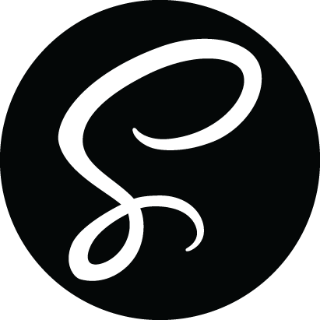

**Hello, World!** 👋🏾

My name is Cynthia (but you can call me cynth). I'm a Full-Stack JavaScript Developer, and a unicorn.

- 👀 I am currently working on some challenges on Frontend Mentor to improve my front-end development.
- 👀 I’m interested in systems design, architecture and cloud computing.
- 👀 I’m currently learning web and mobile application design and development using the JAM stack and a bunch of other technologies.
- 👀 I’m looking to collaborate on, well - almost anything. My interests are somewhat without bounds. I would kindly assist on any project as a designer or developer, provided I resonnate with the mission and intent of the project.
- 👀 How to reach me:  I'm still thinking about that.

**Languages**:

  
  &nbsp;&nbsp;&nbsp;&nbsp;&nbsp;
  
  &nbsp;&nbsp;&nbsp;&nbsp;&nbsp;
  
  &nbsp;&nbsp;&nbsp;&nbsp;&nbsp;
  
  &nbsp;&nbsp;&nbsp;&nbsp;&nbsp;
  

**Tools + Technologies**:

  
  &nbsp;&nbsp;&nbsp;&nbsp;&nbsp;
  
  &nbsp;&nbsp;&nbsp;&nbsp;&nbsp;
  
  &nbsp;&nbsp;&nbsp;&nbsp;&nbsp;
  
  &nbsp;&nbsp;&nbsp;&nbsp;&nbsp;
  
  &nbsp;&nbsp;&nbsp;&nbsp;&nbsp;

**Development Environment**:

  
  &nbsp;&nbsp;&nbsp;&nbsp;&nbsp;
  
  &nbsp;&nbsp;&nbsp;&nbsp;&nbsp;
  
  &nbsp;&nbsp;&nbsp;&nbsp;&nbsp;
  

<!---
**Attributtions**:

Icons made by <a href="https://www.freepik.com" title="Freepik">Freepik</a> from <a href="https://www.flaticon.com/" title="Flaticon">www.flaticon.com</a>

--->

<!---
likelytwitchdollop/likelytwitchdollop is a ✨ special ✨ repository because its `README.md` (this file) appears on your GitHub profile.
You can click the Preview link to take a look at your changes.
--->
